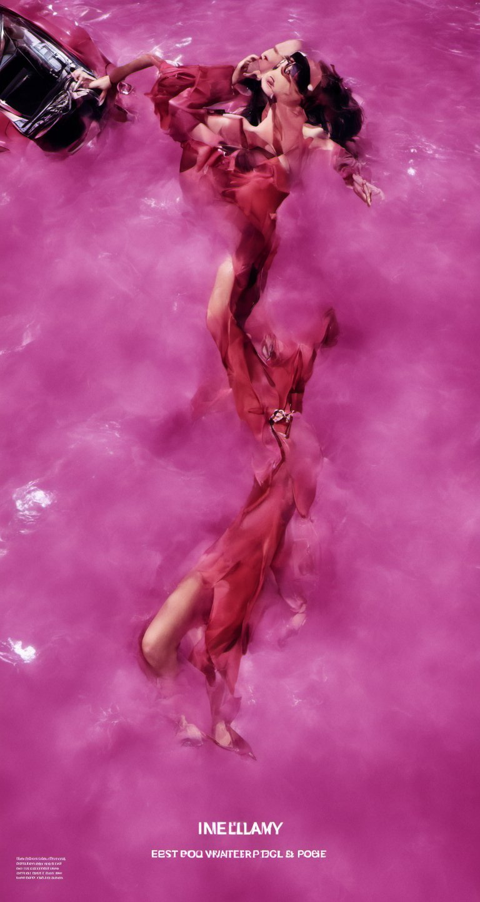

# Image Compression Stable Diffusion XL Lora

To purposefully try and induce glitches into the model, one effective technique has been image compression going into the trainer. I did a few different variations on this with different 
resolutions using cropped and uncropped datasets, as well as bucketing and non-bucketing. Initially, I set the max training resolution to be 512 x 512 and used cropped 800 x 1000 images, 
so the trainer had to compress them down to 512 x 512. I then did the same thing on an uncropped dataset where all the images were compressed down to 512 x 512 by the trainer from resolutions as 
high as 4961 x 3508. I also did the same for the uncropped dataset, but to a max training resolution of 1024 x 1024.

# Results

  
  
  
  

  
  
  
  

  
  
  

# Generation

**Settings:**

Sampler: DPM++ 2M or Euler Sampling Steps: 20 CFG Scale: 7

**Example Prompts:**

Again, for the prompting, I used some of the captions provided with the images with no negative prompting to try and make it as glitchy as possible. 

It seems the longer the prompt, the unstable the generation becomes. 

I tried generating with multiple different aspect ratios to bring out the compression artifacts. 

E.G 

1088x896, 

1152x896 

1216x832 

1344x768 

1472x704 

1536x640 

1856x512 

