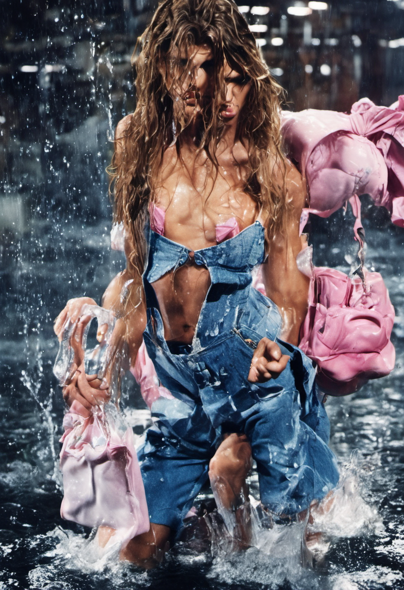
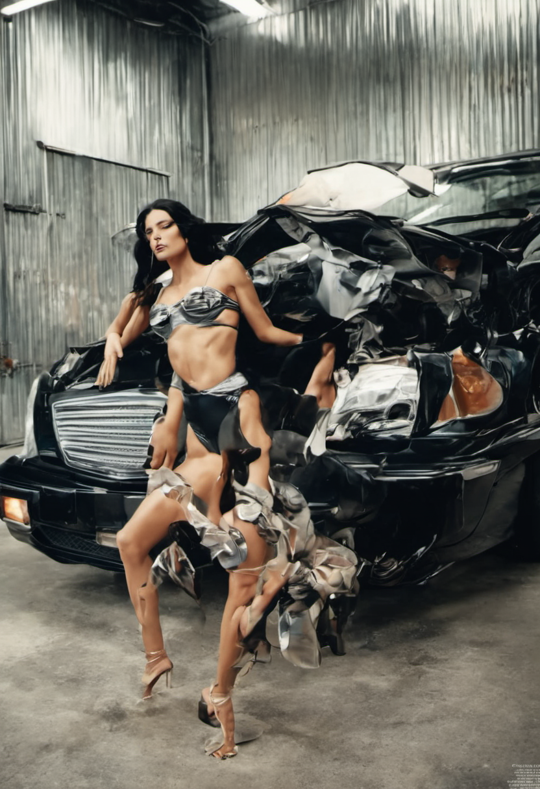
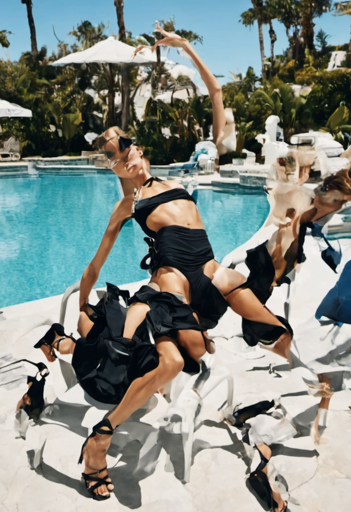
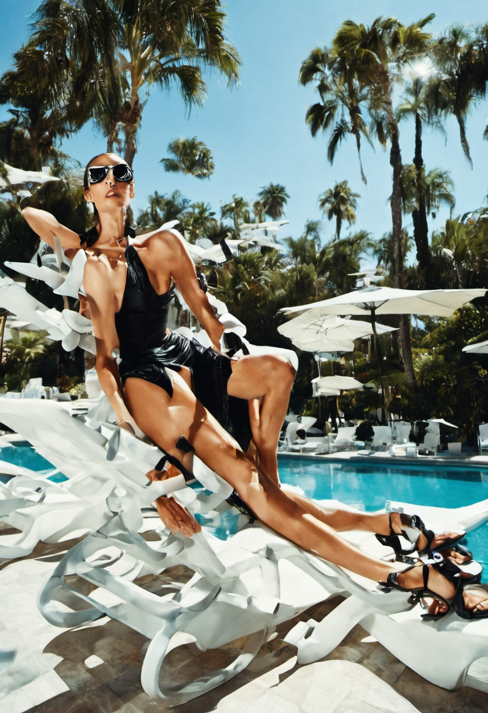

# Overtraining + Compression Stable Diffusion XL Lora 

For this technique, I used the previous technique of image compression with overtraining to further induce glitches into the Lora.  
Usually, the number of times the trainer looks over each image is around 10 repeats per image For this Lora, I set this value to 900, which should massively overfit the data and 
induce artifacts.

# Results 

  
  
  
  
  

