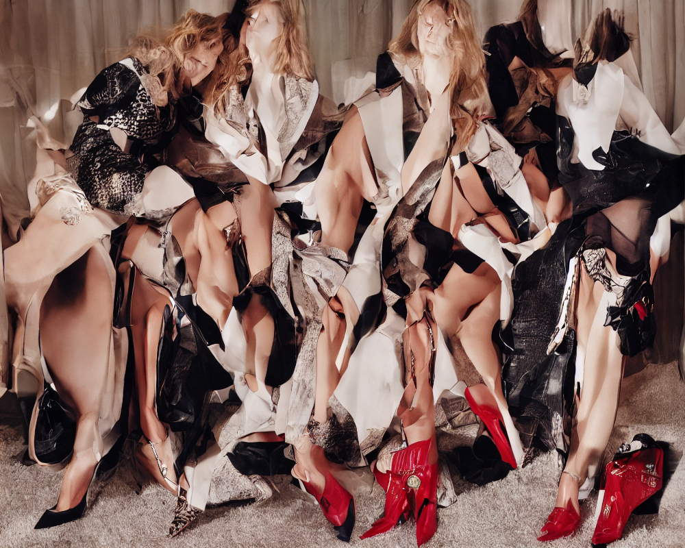
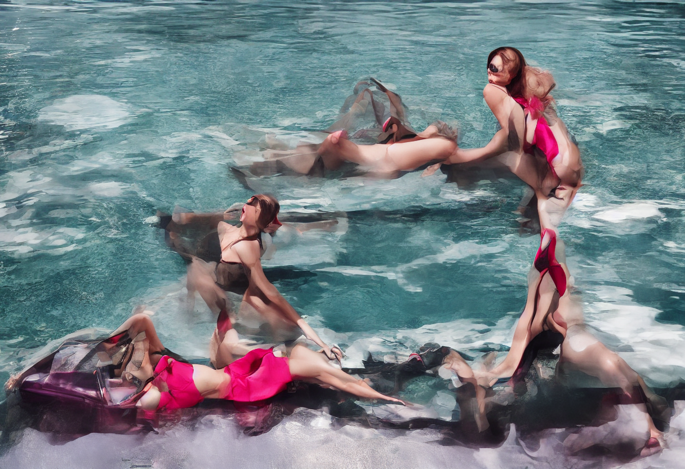
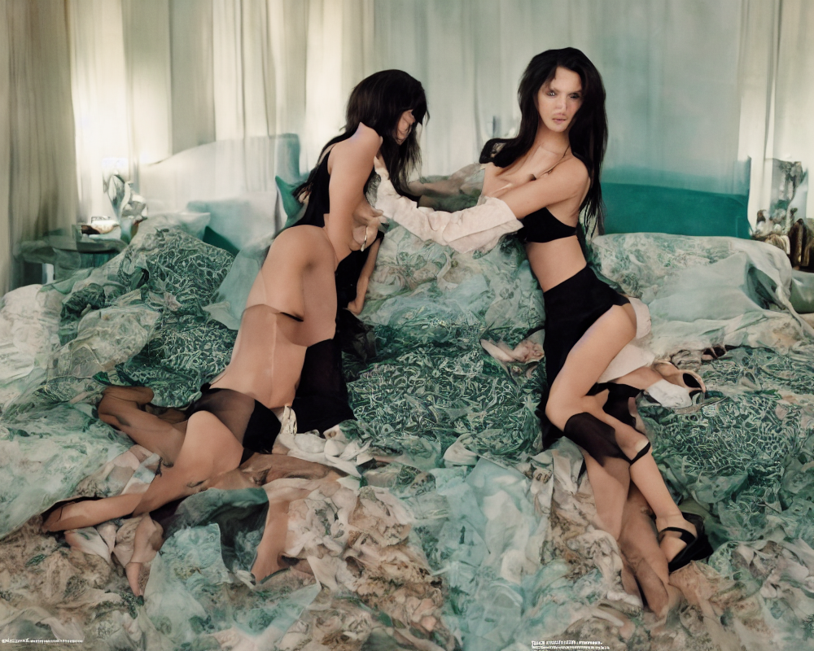
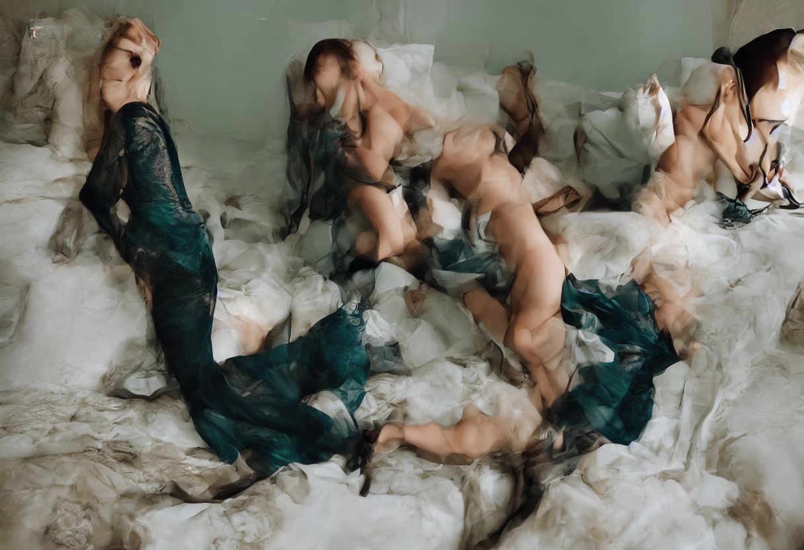
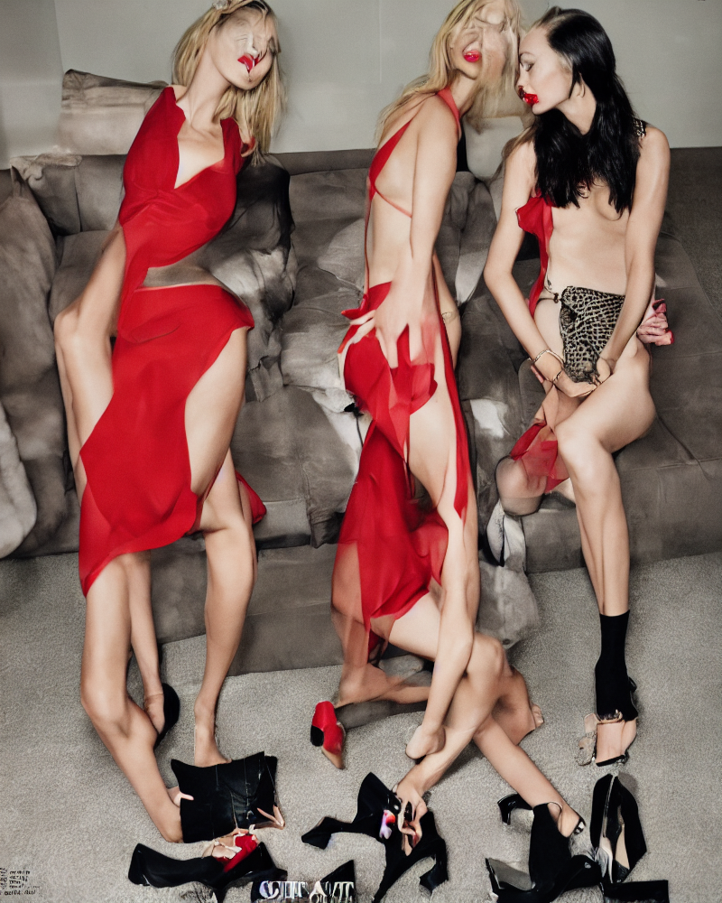
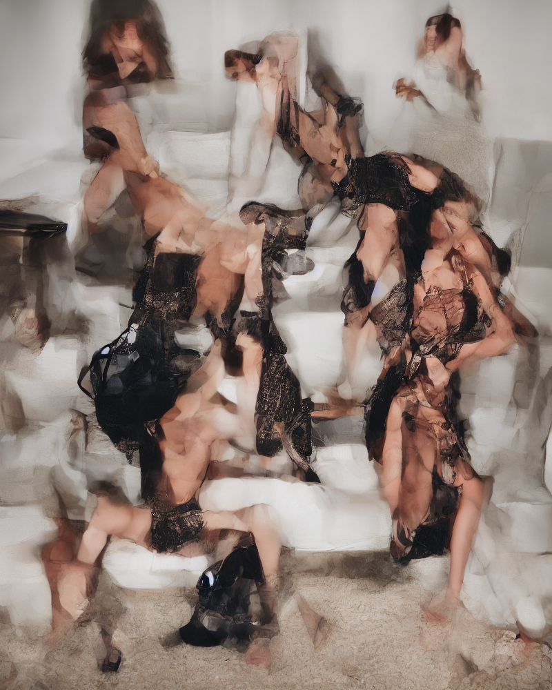
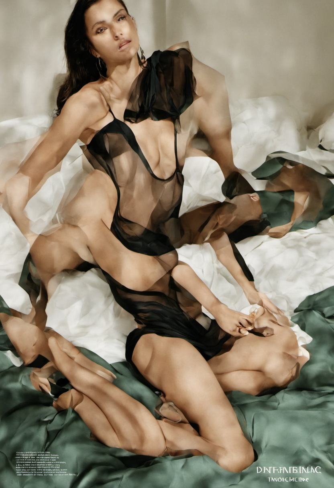
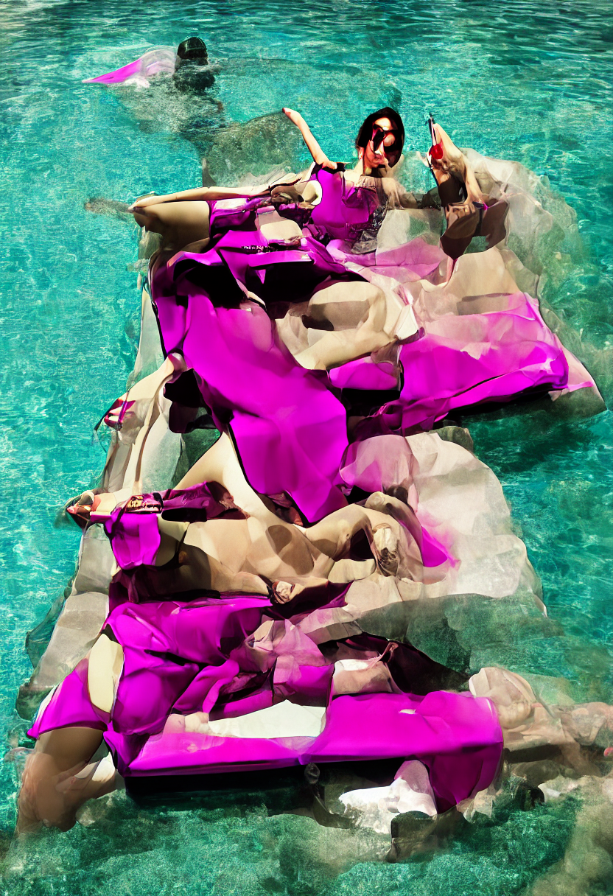

# SD1.5 Compressed/Uncropped

As with SDXL, the Lora was trained on uncropped images with a max training resolution of 512 x 512 to induce glitches and artifacts into the loRA.
I also experimented with different cfg amounts from 3 - 10 and sampling steps from 5 - 10. 

# Results

