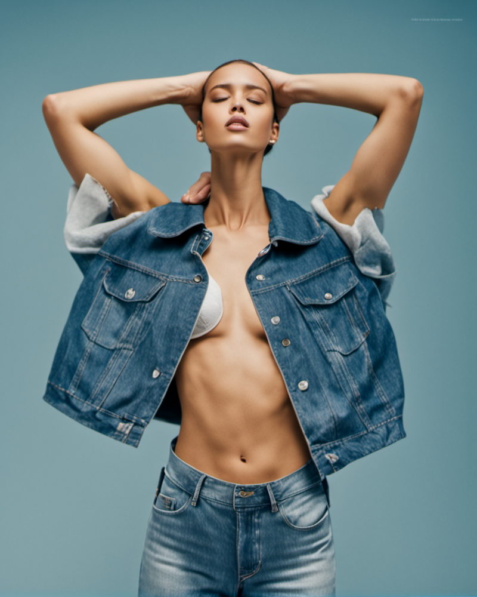
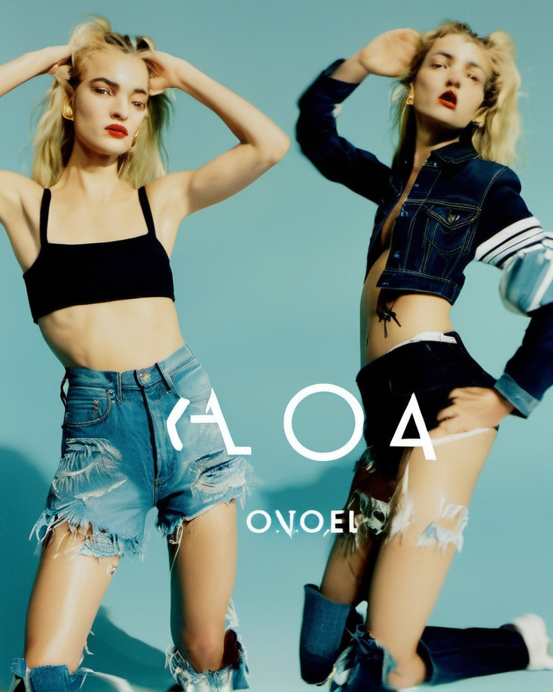
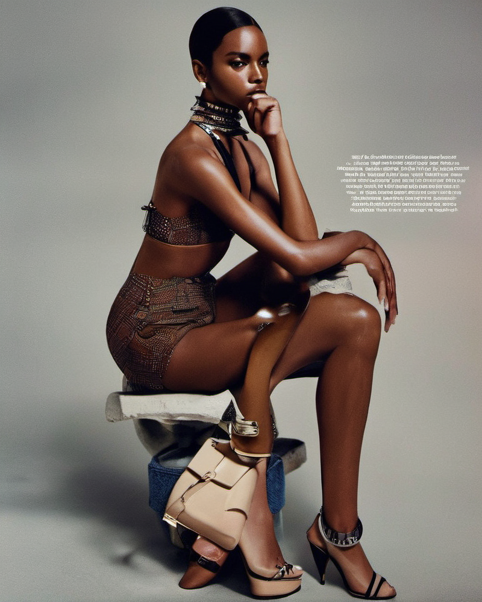
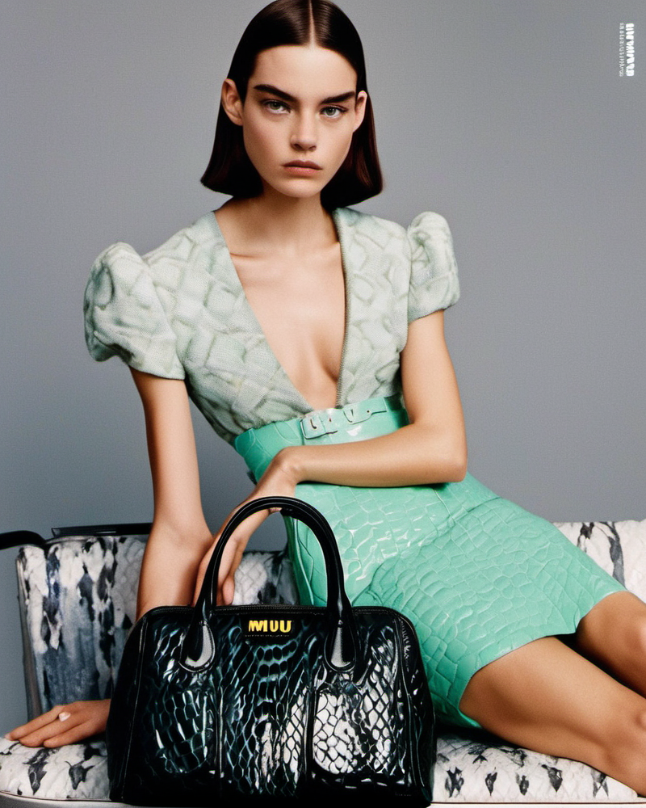
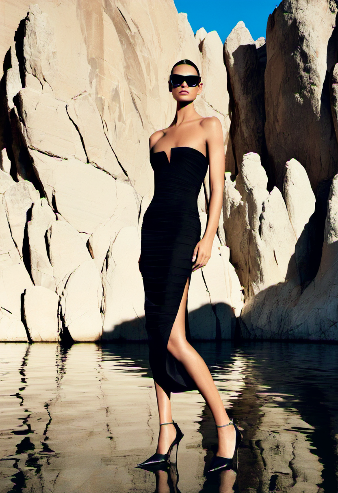
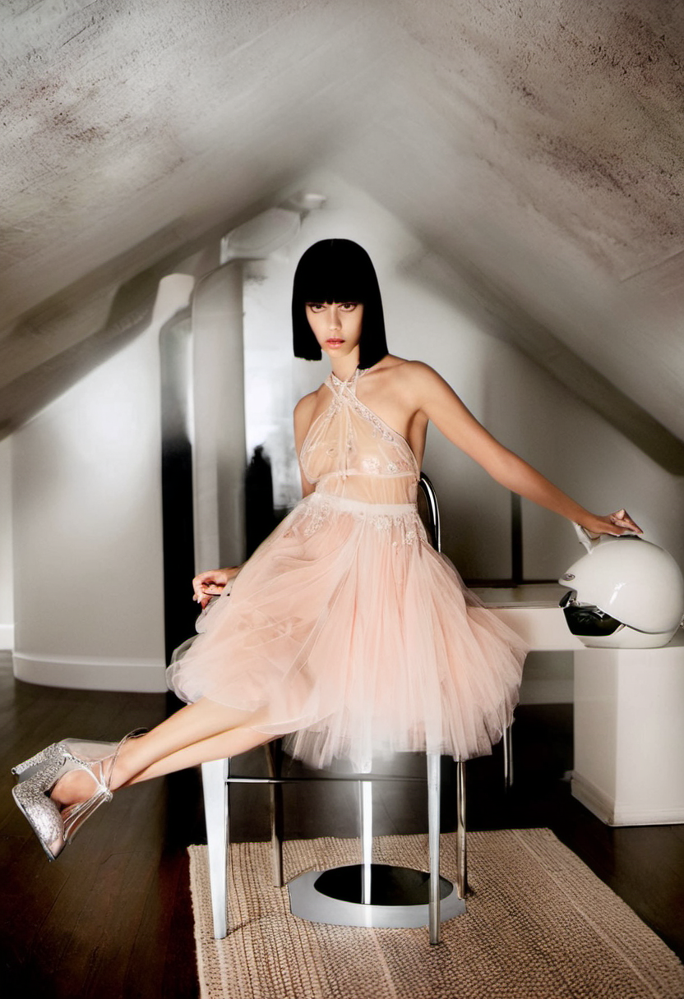
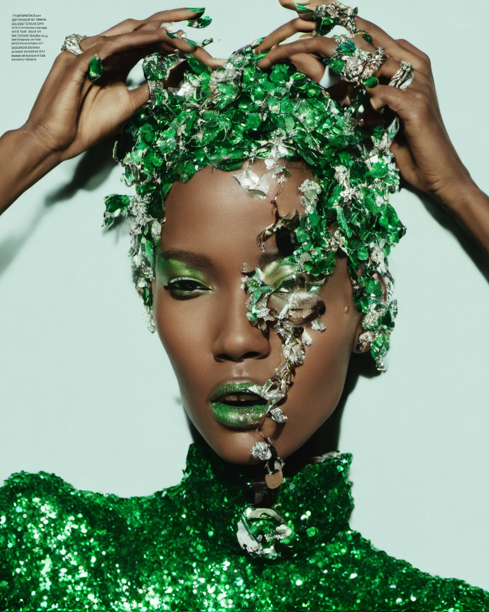
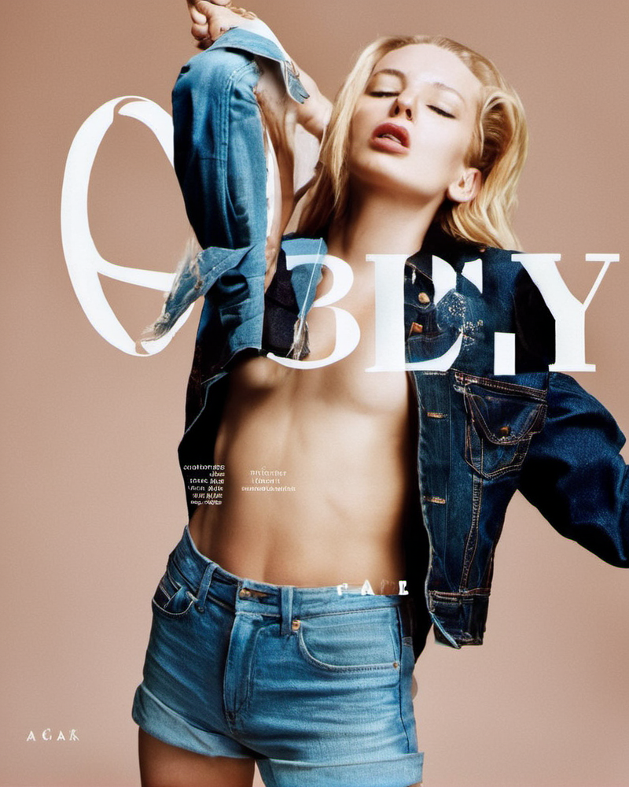
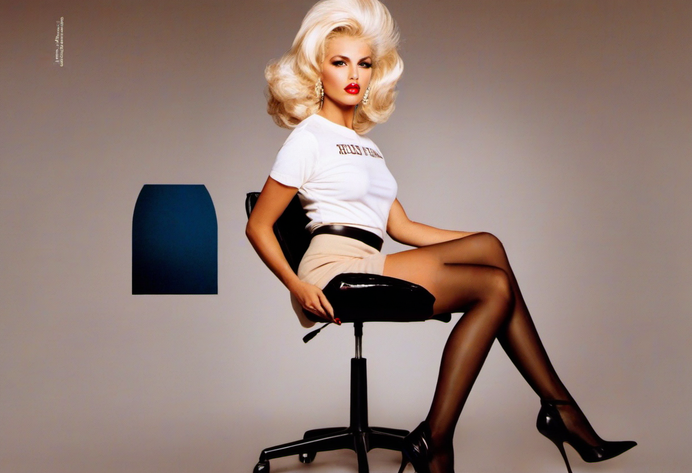

# Standard Stable Diffusion XL Lora

Standard Stable Diffusion XL Lora to reproduce the training data without purposefully inducing glitches. Preprocessed the data by cropping every image to portrait 832 x 1216 and landscape 1216 x 832, and then set the maximum training resolution
to the same dimensions. This was the initial starting point to see how well the Lora would learn the style from the data and test the text encoding from the captions. 

This model was trained for 8000 Steps. 

# Results

  
  
  
  

  
  
  
  

  
  

# Notes 

