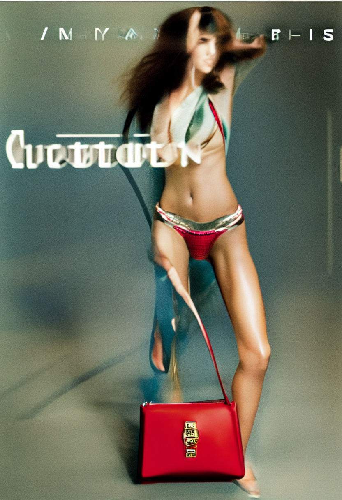

# Stable Diffusion 1.5 Standard loRa

This loRA was trained on cropped 832 x 1216 portrait and vice versa landscape images for stable diffusion 1.5. Trying to get the loRA to replicate the style as with SDXL. 
I experimented with inducing glitches into the generation by using low sampling steps.  Below are some results from experiments where the sampling step was changed from 5 to 20 in increments. 

# Results

